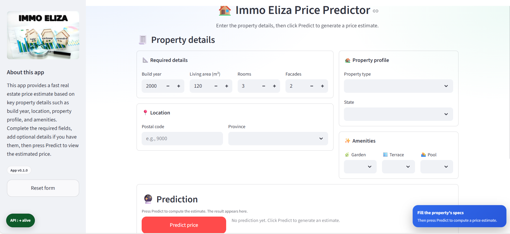

# Real Estate Price Prediction (Belgium) — Immo Eliza

A fast, reproducible ML inference service to estimate Belgian property prices using a trained model and reference data (postal code ↔ province). This repository contains:

- **FastAPI backend** exposing a clean `/predict` endpoint for inference
- **Streamlit UI** for interactive predictions (dropdowns + input validation)
- **Docker + Docker Compose** to run both services consistently

---

## 📑 Table of contents
- [Description](#description)
- [Repository structure](#repository-structure)
- [Requirements](#requirements)
- [Installation](#installation)
- [Run (local)](#run-local)
- [Run with Docker (production-like)](#run-docker)
- [Streamlit UI](#streamlit-ui)
- [How it works](#how-it-works)
- [Deployment](#deployment)
- [Contributors](#contributors)


---

<a id="description"></a>

## 🔎 Description

This service predicts a property price based on structured inputs such as build year, living area, rooms, facades, state, property type, and amenities. Location is required via **either** a postal code (validated against a reference file) **or** a province.

The backend loads pre-trained artifacts from `backend/artifacts/` and uses `backend/data/postal_code_ref.csv` to validate postal codes and infer/verify the canonical province used in feature engineering.

---

<a id="repository-structure"></a>

## 🗂️ Repository structure

```text
immo-eliza-deployment-v2/
├─ backend/
│  ├─ app/
│  │  ├─ __init__.py
│  │  ├─ app.py          # FastAPI entrypoint + health/readiness
│  │  ├─ predict.py     # artifact load + preprocess + inference
│  │  └─ schemas.py    # request/response schemas + constants
│  ├─ artifacts/
│  │  ├─ pipeline.joblib
│  │  └─ xgboost_log_model.pkl
│  ├─ data/
│  │  └─ postal_code_ref.csv
│  └─ requirements.txt
│
├─ streamlit_app/
│  ├─ app.py             # Streamlit UI (calls backend /predict)
│  ├─ requirements.txt
│  └─ assets/
│     └─ immo-eliza.png      # sidebar image shown in the UI
│     └─ ui.png             # # screenshoot of streamlit UI
├─ docker/
│  ├─ backend.Dockerfile
│  └─ streamlit.Dockerfile
│
├─ docker-compose.yml
├─ .dockerignore
├─ .gitignore
└─ README.md
```

<a id="requirements"></a>

## ✅ Requirements


### Python versions (important)

This repository uses **separate virtual environments** per component:

- **Backend (FastAPI / ML inference):** Python **3.14**  
  Venv path: `backend\.venv\`

- **Streamlit UI:** Python **3.13**  
  Venv path: `streamlit_app\.venv\`

> Note: Python 3.14 is still new for some ML dependencies. If you hit install issues on the backend, consider switching the backend to Python 3.13 for broader wheel support.

Docker

For Docker Compose usage, install Docker Desktop (or Docker Engine) and ensure docker compose works on your machine.

<a id="installation"></a>

## 🛠️ Installation


### Backend (Python 3.14)

```powershell
cd backend
py -3.14 -m venv .venv
.\.venv\Scripts\Activate.ps1
python -m pip install -U pip
pip install -r requirements.txt
```

### Streamlit (Python 3.13)

```powershell
cd ..\streamlit_app
py -3.13 -m venv .venv
.\.venv\Scripts\Activate.ps1
python -m pip install -U pip
pip install -r requirements.txt
```

<a id="run-local"></a>

## 🧪 Run (local)


### 1) Run the backend (FastAPI)

Open a terminal:

```powershell
cd backend
.\.venv\Scripts\Activate.ps1
uvicorn app.app:app --reload --host 0.0.0.0 --port 8000
```

### 2) Run the Streamlit UI

Open a second terminal:

```powershell
cd streamlit_app
.\.venv\Scripts\Activate.ps1
streamlit run app.py --server.port 8501
```

**Backend**

```powershell
cd C:\Users\welde\Desktop\immo-eliza-deployment-v2\backend
py -3.13 -m venv .venv
.\.venv\Scripts\Activate.ps1
python -m pip install -U pip
pip install -r requirements.txt
``` 

**Streamlit**

```powershell
cd C:\Users\welde\Desktop\immo-eliza-deployment-v2\streamlit_app
py -3.13 -m venv .venv
.\.venv\Scripts\Activate.ps1
python -m pip install -U pip
pip install -r requirements.txt
``` 

<a id="run-docker"></a>

## 🐳 Run with Docker (production-like)


Requires Docker Desktop.
No local venv required.

**Usage**

1) Run backend (FastAPI)

```powershell 
cd C:\Users\welde\Desktop\immo-eliza-deployment-v2\backend
.\.venv\Scripts\Activate.ps1
uvicorn app.app:app --reload --port 8000
``` 

Health check:

```powershell
http://localhost:8000/ → alive

``` 

2) Run Streamlit UI

```powershell
cd C:\Users\welde\Desktop\immo-eliza-deployment-v2\streamlit_app
.\.venv\Scripts\Activate.ps1
streamlit run app.py --server.port 8501

```

Open:

http://localhost:8501

In the sidebar set:

API base URL: http://localhost:8000 (do not predict)

3) Run both with Docker Compose

```powershell
cd C:\Users\welde\Desktop\immo-eliza-deployment-v2
docker compose up --build
```

**Open**:

Streamlit: http://localhost:8501

Backend: http://localhost:8000

**Stop**:

```powershell
docker compose down
```


<a id="streamlit-ui"></a>

## 🖥️ Streamlit UI


Run the Streamlit Application Locally
The Streamlit application (app.py) provides an interactive interface for predictions.

You can then access the application in your web browser, typically at http://localhost:8501



Required fields:

- `build_year` (int)
- `living_area` (float > 0)
- `number_rooms` (int)
- `facades` (int)
- location: provide **either** `postal_code` (4 digits) **or** `province`

Optional fields:

- `property_type`, `state`,  `garden`,  `terrace`,  `swimming_pool`

After filling the form press predict price and the predicted price will be displayed according to the property details entered. Press reset button on the left side to reset the form and refill again to predict another property.

<a id="how-it-works"></a>

## ⚙️ How it works


### 1) Loading artifacts

On startup, the backend loads the trained model artifacts

### 2) Input validation (hard rules)

Validation is enforced in `backend/app/schemas.py` and `backend/app/predict.py`:

- `living_area`, `facades`, `number_rooms` are mandatory
- location is mandatory: **postal_code OR province**
- If `postal_code` is provided, it must exist in `backend/data/postal_code_ref.csv`
- If both `postal_code` and `province` are provided, they must match

### 3) Inference

The pipeline produces a numeric prediction which is formatted into `prediction_text` (EUR string). Non-blocking issues (e.g., missing optional fields) are returned as a single-line `warning` when applicable.

<a id="deployment"></a>

## ☁️ Deployment

This application is deployed using Streamlit Sharing and is accessible at: https://immo-eliza-deployment-v2-mm5chdvgf6maztxrhttbxu.streamlit.app/

<a id="contributors"></a>

## 👥 Contributors

This project is part of AI & Data Science Bootcamp training at **</becode** and it was done by: 

- Welederufeal Tadege [LinkedIn](https://www.linkedin.com/in/) | [Github](https://github.com/welde2001-bot) 
under the supervision of AI & data science coach ***Vanessa Rivera Quinones***